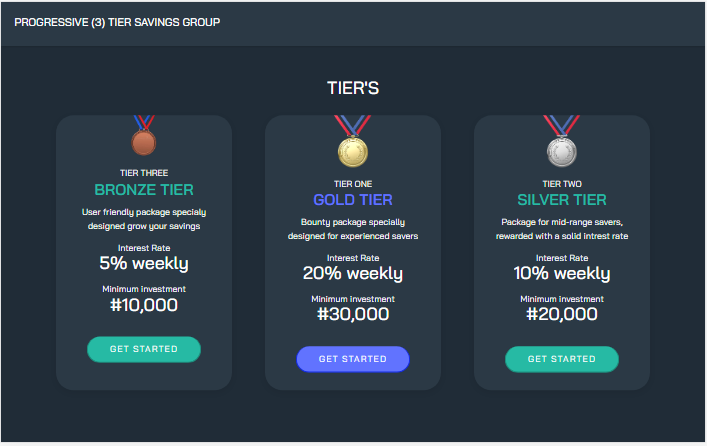

# WEB3BRIDGE MIGRATION QUIZE
# Project issued by Web3bridge 

## Table of contents

- [Overview](#overview)
  - [Screenshot](#screenshot)
  - [Links](#links)
  - [Built with](#built-with)
  - [Expected Behaviour](#Expected-behaviour)

### overview! 👋
Thanks for checking out this migration quize.
This is a solution to a quize issued by web3bridge to determine migration in the web3 package for the cohort VIII. 

### Screenshot

### Links

- Solution URL: [Click here for solution URL](https://github.com/Nonnyjoe/web3bridge-migration-test)
- Live Site URL: [Click here for live site](https://nonnyjoe.github.io/web3bridge-migration-test/)

### Built with

- Semantic HTML5 markup
- CSS custom properties
- Bootstrap
- JavaScript

### Expected behaviour

- Allow users select their prefaired tier.
- Users should be able to input their name and also their investing ammount.
- Validate the user entry to ensure the investment form is filled with the expected ammount and name.
- Update the total ballance of the tier and also the total number of investors in that tier.
- display a list of all the investors in each their, also giving them an option to withdraw their funds.
- On withdrawal update the list of investors, total ballance of tier and also the number of investors.
- Uniquely store all data's such that they display properly no matter the navigation path (AS LONG AS THE PAGE IS NOT RELOADED).
- And much more.
